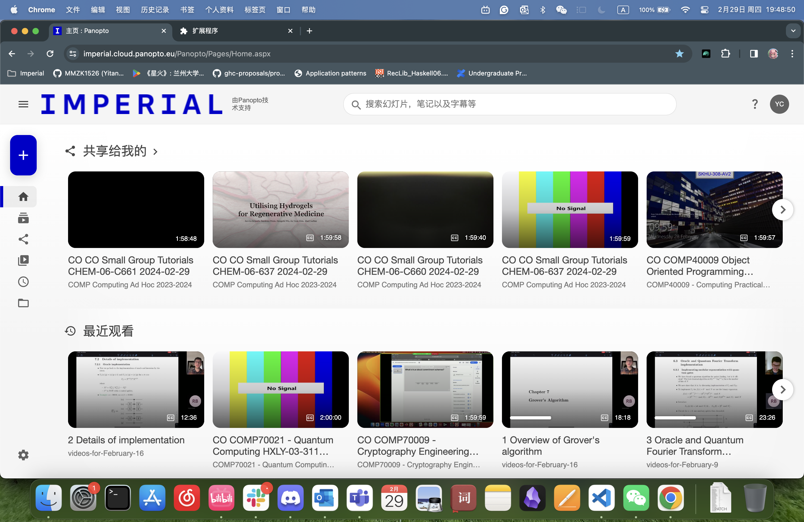

# Say No to the New Imperial College London Logo!

Imperial College London has recently created a new logo as part of their rebranding project. However, a substantial proportion of students and staff members strongly dislike the design of the new logo: it is ugly, does not respect the most basic 2D design patterns, and fails to properly represent the university.

This extension does its best to reverse the ill-designed logo and atrocious colour scheme on the Imperial College website as well as some of its subsidiary teaching platforms.

Note that it may not cover all places and pages since I focused on the pages that I use the most. Of course, any suggestions and additions are welcome!

Please also support [this petition](https://www.change.org/p/stop-the-new-imperial-logo)!

## Example

**Before**:

**After**:

## Installation

Download from [here](https://chromewebstore.google.com/detail/i/nfajkinennmghnmbhehcihgoogobfpmh).

## Features

It currently covers the [official website](), [Imperial Panopto](https://imperial.cloud.panopto.eu/Panopto/Pages/Home.aspx), and [Microsoft PowerApp](https://apps.powerapps.com/) (because I use it to manage my casual worker claims).

- Revert the new icon (including favicon) and logo to the old ones.
- Replace the infamous "Imperial Blue" (#0000CD) to a nicer blue.
